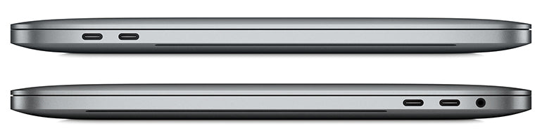

# Ports and Adapters

This Go repository provides a demonstration of the Ports and Adapters architectural pattern. In software design, the Ports and Adapters pattern (also known as the Hexagonal Architecture) separates the core business logic (the domain) from external concerns like input/output or infrastructure. It allows for easy adaptation to various external systems, making your software more flexible and maintainable.

Imagine you have a MacBook with a Type-C Thunderbolt port, a versatile and high-speed connection. However, you often find yourself needing to connect various external devices, some of which use older USB standards, such as USB Type-A or Micro USB. In such cases, you may need to buy additional adapters or converters to bridge the gap between your MacBook's Type-C Thunderbolt port and the connectors of your external devices.

## Repository Contents:

- main.go: The main entry point of the application.
- mac/: Contains the core application logic, following the Ports and Adapters pattern.
- adapter/: define the interfaces for connecting external devices.
- port/: define various external devices, including USB Type-A, Micro USB, and USB Type-C.
